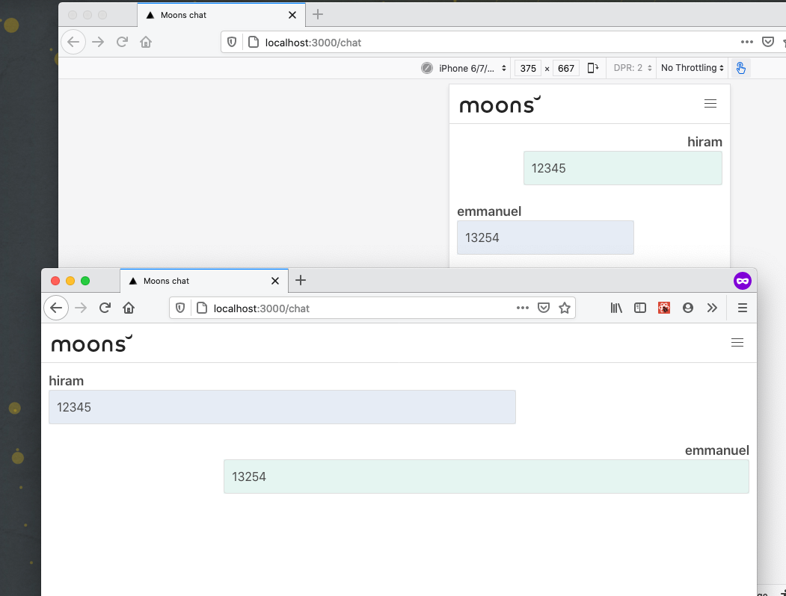

<!-- PROJECT LOGO -->
<br />
<p align="center">
  <a href="https://github.com/othneildrew/Best-README-Template">
    
  </a>

  <h3 align="center">Moons Chat</h3>


<!-- TABLE OF CONTENTS -->
## Table of Contents

* [Getting Started](#getting-started)
  * [Prerequisites](#prerequisites)
  * [Installation](#installation)
* [Usage](#usage)


<!-- GETTING STARTED -->
## Getting Started

This is an example of how you may give instructions on setting up your project locally.
To get a local copy up and running follow these simple example steps.

### Prerequisites

This project requires Node 10.16.3 version or later

### Installation

Clone this repo

```sh
git clone git@github.com:driverInside/moons-chat.git
```

Install dependencies

```sh
yarn install
```

or

```sh
npm i
```


<!-- USAGE EXAMPLES -->
## Usage


Run the app:

```sh
yarn dev
```

Or

```sh
npm run dev
```
